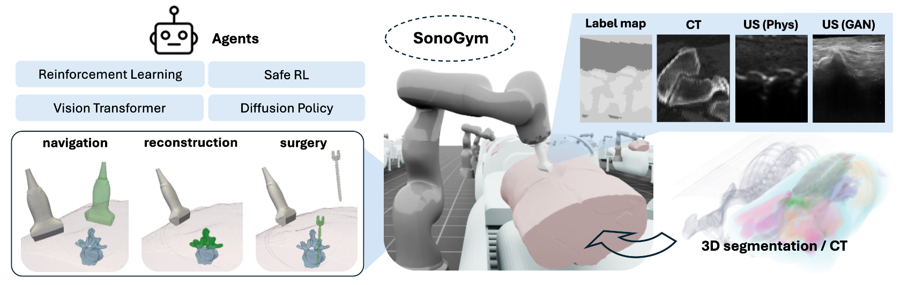

# SonoGym: High Performance Simulation for Challenging Surgical Tasks with Robotic Ultrasound

[](https://docs.omniverse.nvidia.com/isaacsim/latest/overview.html)
[](https://isaac-sim.github.io/IsaacLab)
[](https://docs.python.org/3/whatsnew/3.10.html)


## Overview



SonoGym is a scalable training platform for challenging (orthopedic) surgical tasks with robotic ultrasound, built on NVIDIA IsaacLab (https://github.com/isaac-sim/IsaacLab). We provide model-based and learning-based ultrasound (US) simulation based on 3D label map and CT scans from real patient datasets.
Our tasks include path planning for US navigation, bone surface reconstruction, and US-guided robotic surgery. 
Our platform enables benchmarking of various algorithms, including reinforcement learning (RL), safe RL, and imitation learning.


## Installation
### Install codes
- Install Isaac Lab by following the [installation guide](https://isaac-sim.github.io/IsaacLab/v2.1.0/source/setup/installation/pip_installation.html) (IsaacLab V2.1.0). We recommend using the conda installation as it simplifies calling Python scripts from the terminal.

- Clone this repository separately from the Isaac Lab installation (i.e. outside the `IsaacLab` directory):

```bash
# Option 1: HTTPS
git clone https://github.com/SonoGym/SonoGym.git

# Option 2: SSH
git clone git@github.com:SonoGym/SonoGym.git
```


- Using a python interpreter that has Isaac Lab installed, install the library

```bash
python -m pip install -e source/spinal_surgery
```
### Download simulation assets and ultrasound simulation models
Download the simulation assets and ultrasound simulation models from https://huggingface.co/datasets/yunkao/SonoGym_assets_models

The folder contains 2 archived folders:
- assets: simulation assets including medical imaging, human models, robots and end-effectors.
- models: pix2pix models for learning-based ultrasound simulation.


Unzip and put the downloaded directories in the following path respectively:
```
assets -> SonoGym/source/spinal_surgery/spinal_surgery/assets
models -> SonoGym/models
```

### Download expert dataset (optional)

Download the dataset from https://huggingface.co/datasets/yunkao/SonoGym_lerobot_dataset following the instruction in https://huggingface.co/docs/hub/en/datasets-downloading or https://huggingface.co/docs/huggingface_hub/main/en/guides/download.

This dataset allow training imitation learning policies with lerobot repo (https://github.com/huggingface/lerobot) for surgery and navigation, not necessary for training RL agents.

Specifically, they are collected with the following settings:
- ```Isaac-robot-US-guidance-v0-single```: ultrasound guidance, single patient, model-based US simulation
- ```Isaac-robot-US-guidance-v0-single-net```: ultrasound guidance,single patient, learning-based US simulation
- ```Isaac-robot-US-guidance-5-models-v0```: ultrasound guidance,single patient, 4 learning-based US simulation networks
- ```Isaac-robot-US-guided-surgery-v0-single-new```: ultrasound-guided surgery, single patient, model-based US simulation
- ```Isaac-robot-US-guided-surgery-v0-single-net-new```: ultrasound-guided surgery, single patient, learning-based US simulation
- ```Isaac-robot-US-guided-surgery-v0-5-net```: ultrasound-guided surgery,single patient, 4 learning-based US simulation networks
- ```Isaac-robot-US-guided-surgery-v0-5```: ultrasound-guided surgery,5 patient, model-based US simulation


It is recommended to put the downloaded dataset in the following path:
```
SonoGym/lerobot-dataset
```

## Play with teleoperation
Yon can play the robot with keyboard in a task environment with the following command:

(**Note: When you run it the first time, IsaacSim might take long to load**)

```bash
python workflows/teleoperation/teleop_se3_agent.py --task=Isaac-robot-US-guidance-v0
```

```--task``` argument can be chosen from
- Isaac-robot-US-guidance-v0
- Isaac-robot-US-guided-surgery-v0
- Isaac-robot-US-reconstruction-v0

## Training and testing

### Training with default settings

#### Reinforcement learning agents
You can train PPO agent with skrl with the following command:

```bash
python workflows/skrl/train.py --task=Isaac-robot-US-guidance-v0
```

You can also train PPO with a cost predictor only for ```Isaac-robot-US-guided-surgery-v0``` with the following command:
```bash
python workflows/skrl/train_sppo.py
```

The reinforcement learning agent dafault configs can reproduce our results in the paper. You can modify the configs at 
```
source/spinal_surgery/spinal_surgery/tasks/{tasks_name}/agents/skrl_{algorithm}_cfg.yaml
```

#### Imitation learning agents

To train imitation learning agents, first install ```lerobot``` from https://github.com/huggingface/lerobot/tree/a445d9c9da6bea99a8972daa4fe1fdd053d711d2 

After downloading the expert dataset, you can also train ACT or diffusion policy with:

```bash
python /path-to-lerobot/lerobot/scripts/train.py --config_path=workflows/lerobot/train_surgery_{method}_cfg.json
```
where ```method``` can be either 'diffusion' or 'act'. Remmember to change ```"dataset": "root"``` to the path of your local dataset like ```path-to-repo/SonoGym/lerobot-dataset/Isaac-robot-US-guidance-v0-single-net```.


### Change environment settings
Environment configurations are located under

```bash
source/spinal_surgery/spinal_surgery/tasks/{task_name}/cfgs/{task_name}.yaml
```
For example, you choose model-based or learning-based ultrasound simulation for the ```robot_US_guidance``` task by setting
```
sim:
    us: 'net'  # for learning-based, or 'conv' for model-based 
```
in ```source/spinal_surgery/spinal_surgery/tasks/robot_US_guidance/cfgs/robot_US_guidance.yaml```.

To turn on or turn off the visualization, you can also set

```
sim:
    vis_us: true  # or false
```

If the program died only with ```vis_us``` on, try uninstall ```PyQt5``` and reinstall ```opencv-python```. 

### Play a checkpoint
PPO checkpoint can be played via:
```bash
python workflows/skrl/play.py --task {task_id} --checkpoint /path-to-checkpoint --num_envs 100
```
PPO + safety filter checkpoint for the ultrasound-guided-surgery environment can be played via:
```bash
python workflows/skrl/play_sppo.py --checkpoint /path-to-checkpoint --num_envs 100
```
lerobot checkpoints (for example, ACT for ```ultrasound guidance```) can be played by:
```
python workflows/lerobot/play_lerobot_guidance.py --policy.config=workflows/lerobot/play_guidance_act_cfg.json --policy.path=/path-to-checkpoint/pretrained_model
```

## Docker setup

### Building Isaac Lab Base Image

Currently, we don't have the Docker for Isaac Lab publicly available. Hence, you'd need to build the docker image
for Isaac Lab locally by following the steps [here](https://isaac-sim.github.io/IsaacLab/main/source/deployment/index.html).

Once you have built the base Isaac Lab image, you can check it exists by doing:

```bash
docker images

# Output should look something like:
#
# REPOSITORY                       TAG       IMAGE ID       CREATED          SIZE
# isaac-lab-base                   latest    28be62af627e   32 minutes ago   18.9GB
```

### Building Isaac Lab Template Image

Following above, you can build the docker container for this project. It is called `isaac-lab-template`. However,
you can modify this name inside the [`docker/docker-compose.yaml`](docker/docker-compose.yaml).

```bash
cd docker
docker compose --env-file .env.base --file docker-compose.yaml build isaac-lab-template
```

You can verify the image is built successfully using the same command as earlier:

```bash
docker images

# Output should look something like:
#
# REPOSITORY                       TAG       IMAGE ID       CREATED             SIZE
# isaac-lab-template               latest    00b00b647e1b   2 minutes ago       18.9GB
# isaac-lab-base                   latest    892938acb55c   About an hour ago   18.9GB
```

### Running the container

After building, the usual next step is to start the containers associated with your services. You can do this with:

```bash
docker compose --env-file .env.base --file docker-compose.yaml up
```

This will start the services defined in your `docker-compose.yaml` file, including isaac-lab-template.

If you want to run it in detached mode (in the background), use:

```bash
docker compose --env-file .env.base --file docker-compose.yaml up -d
```

### Interacting with a running container

If you want to run commands inside the running container, you can use the `exec` command:

```bash
docker exec --interactive --tty -e DISPLAY=${DISPLAY} isaac-lab-template /bin/bash
```

### Shutting down the container

When you are done or want to stop the running containers, you can bring down the services:

```bash
docker compose --env-file .env.base --file docker-compose.yaml down
```

This stops and removes the containers, but keeps the images.

## Cluster Setup 
### Configuring cluster parameters and export to sigularity image
Copy the ```docker/cluster_extension``` folder to ```IsaacLab/docker```.
Follow https://isaac-sim.github.io/IsaacLab/main/source/deployment/cluster.html, configure the cluster parameters and export to singularity image by running under ```IsaacLab```:
```
./docker/cluster_extension/cluster_interface.sh push
```
By default, it will export the image named ```isaac-lab-template```.

### Copy data
The data in ```source/spinal_surgery/spinal_surgery/assets/data``` can be huge. Instead of copying it with codes every time we submit the job, we can copy it to a path on cluster ```/cluster/path/to/dir/data``` only once through:
```
scp -r source/spinal_surgery/spinal_surgery/assets/data /cluster/path/to/dir/
```

Then by specifying in ```/docker/cluster_extension/.env.cluster```

```
CLUSTER_DATA_PATH=/cluster/path/to/dir/data
```
The script will automatically link ```/cluster/path/to/dir/data``` to the ```/workspace/isaac_extension_template/source/spinal_surgery/spinal_surgery/assets/data``` folder.

### Submitting a job
First import your extension template in the file specified by ```CLUSTER_PYTHON_EXECUTABLE``` in ```.env.cluster``` through ```import spinal_surgery```.

Then you can submit the job through:
```
./docker/cluster_extension/cluster_interface.sh job "argument1" "argument2" ...
```
By default, it will submit a job with image ```isaac-lab-template```. You can change ```profile="template"``` to your own profile name at line ```138``` in ```docker/cluster_extension/cluster_interface.sh```.


## Code formatting

We have a pre-commit template to automatically format your code.
To install pre-commit:

```bash
pip install pre-commit
```

Then you can run pre-commit with:

```bash
pre-commit run --all-files
```

## Troubleshooting

### Pylance Missing Indexing of Extensions

In some VsCode versions, the indexing of part of the extensions is missing. In this case, add the path to your extension in `.vscode/settings.json` under the key `"python.analysis.extraPaths"`.

```json
{
    "python.analysis.extraPaths": [
        "<path-to-ext-repo>/source/spinal_surgery"
    ]
}
```

### Pylance Crash

If you encounter a crash in `pylance`, it is probable that too many files are indexed and you run out of memory.
A possible solution is to exclude some of omniverse packages that are not used in your project.
To do so, modify `.vscode/settings.json` and comment out packages under the key `"python.analysis.extraPaths"`
Some examples of packages that can likely be excluded are:

```json
"<path-to-isaac-sim>/extscache/omni.anim.*"         // Animation packages
"<path-to-isaac-sim>/extscache/omni.kit.*"          // Kit UI tools
"<path-to-isaac-sim>/extscache/omni.graph.*"        // Graph UI tools
"<path-to-isaac-sim>/extscache/omni.services.*"     // Services tools
...
```
